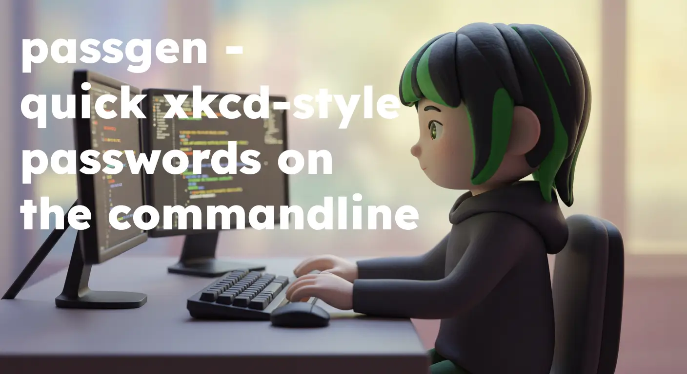

# PassGen - Secure Password Generator

PassGen is a secure, XKCD-style password generator written in Go. It creates memorable yet strong passwords by combining random words with optional customization options.

## Features

- 🛡️ Cryptographically secure random number generation
- 📏 Customizable password length and word count
- 🔠 Option to capitalize words
- 🔢 Add random numbers
- ⚡ Add special symbols
- 📋 Copy to clipboard
- 📦 Single binary deployment

## Installation

### Pre-built Binaries

Download the latest release for your platform from the [Releases page](https://github.com/lunchboxer/passgen/releases).

### From Source

1. Install Go (version 1.20 or higher)
2. Clone the repository:

   ```bash
   git clone https://github.com/lunchboxer/passgen.git
   cd passgen
   ```
3. Build the binary:
   ```bash
   go build -o passgen
   ```

## Usage

```bash
passgen [options]
```

### Options

| Flag         | Description                                      | Default |
|--------------|--------------------------------------------------|---------|
| `-w`, `--words`      | Number of words in the password                 | 4       |
| `-s`, `--separator`  | Separator between words                         | "-"     |
| `-l`, `--length`     | Total length of the password (optional)         | 0       |
| `-c`, `--capitalize` | Capitalize the first letter of each word        | false   |
| `-n`, `--number`     | Add a random number at the end                  | false   |
| `-y`, `--symbol`     | Add a non-word symbol at the end                | false   |
| `-b`, `--clipboard`  | Copy the password to the clipboard              | false   |
| `-h`, `--help`       | Show this help message                          |         |

### Examples

Generate a 4-word password:
```bash
passgen
```

Generate a 6-word password with spaces as separator:
```bash
passgen -w 6 -s " "

